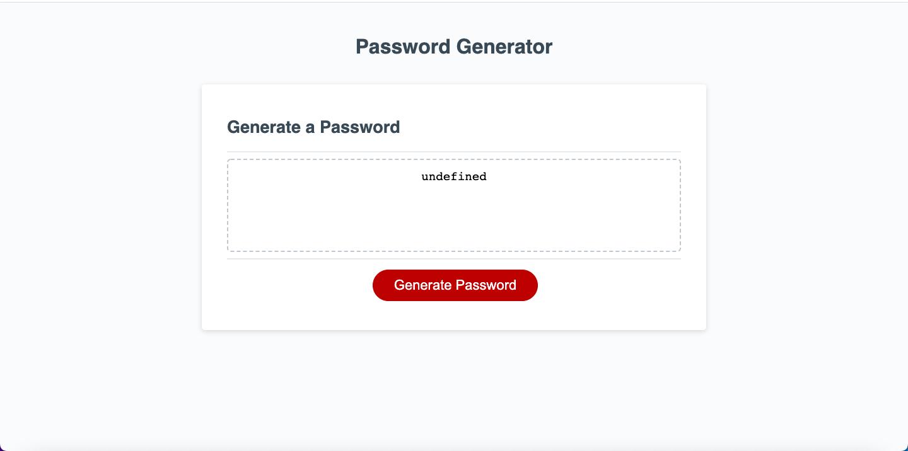

# Password-Generator

## Description
My motivation for this project was to create a useful application that can help me create strong passwords in the future. I built this project to showcase my knowledge of JavaScript and put it use in application that my instructor and future employer will see. The application is useful because it creates a strong, random password each time a password is generated and also creates a password based on the specific criteria you asked for. I learned many things from this project about JavaScript, but the main things I learned were how to utilize window methods, how to manipulate and create arrays, array methods, and the power of for loops and conditional statements.

## Installation 
To install this application go to the url "https://pjt3232.github.io/Password-Generator/" on the browser of your choice.

## Usage
To use this application, go to the url "https://pjt3232.github.io/Password-Generator/". The application should look like the screenshot below:

Then to activate the application, click on the red button that says "Generate Password". This will make the window give you a prompt on how long you want your password to be, but note it must be within 8 to 128 characters or it will force you to exit and start over. After typing how many characters you want your password to be, the window will bring up various criteria. If you want that specific criteria to be included in your password click on "OK" or if you don't want that criteria to be included click on cancel, but please note that one criteria must be selected or the application will not generate a password. Once you select your criteria, the generated password will appear through a notifcation from the window. You can repeat this as many times as you want to create various different passwords. 

## Credits
I used a starter code for this project. The starter code is the second commit on my repo and it makes up all of the HTML and CSS code. The starter code also includes the the "querySelectors" and the "addEventListener" code at the very bottom of the script.js file for this project. The creator of the starter code and the location of the starter code on GitHub can be found below:

Creator: xandromus@github.com
URL of starter code: https://github.com/coding-boot-camp/friendly-parakeet
